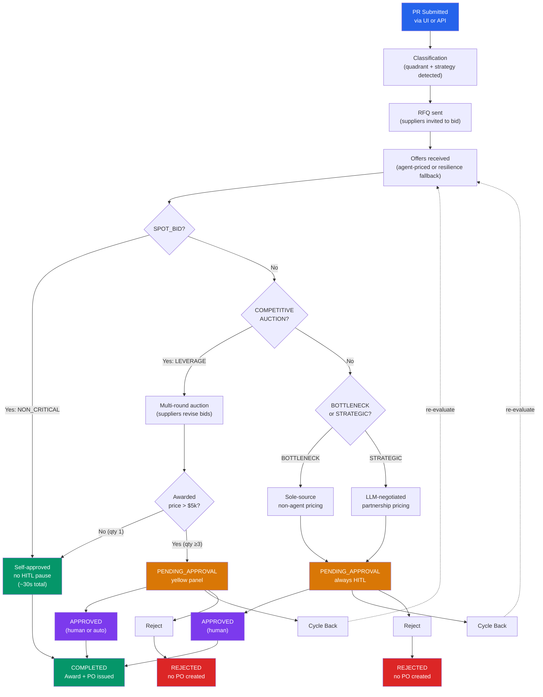

# Buyer Team Demo Guide

This guide walks through a live demonstration of the Buyer Team procurement lifecycle
from PR to PO, using the demo-harness React app alongside the AWS CloudWatch dashboard
and X-Ray tracing. It is designed for a hands-on walkthrough — someone clicks "Submit PR"
while you narrate what happens in the orchestrator and the observability layer.

---

## Prerequisites

```bash
# From impl/
uv sync

# Seed Blue Jets tenant (idempotent — safe to re-run if already seeded)
uv run --package demo-harness python -m demo_harness.seed

# Reset any previous demo runtime data (idempotent — safe to run anytime)
uv run --package demo-harness python -m demo_harness.reset_demo
```

**Start the backend** (one shell):

```bash
cd demo-harness-project/backend
SKILL_MODE=live ENV=dev AWS_REGION=us-east-1 \
  uv run uvicorn demo_harness.main:app --reload --port 8000
```

**Start the frontend** (separate shell):

```bash
cd demo-harness-project/frontend
pnpm install
pnpm dev          # → http://localhost:5174
```

**Open the AWS dashboard** in a browser tab:

```url
https://us-east-1.console.aws.amazon.com/cloudwatch/home?region=us-east-1#dashboards:name=dev-buyer-team-domain
```

---

## Quick-start demo (3 minutes)

1. Open `http://localhost:5174` — the header shows a green "Buyer Team reachable" badge and a second pricing-mode badge: green "LLM agents reachable" when live Bedrock pricing is flowing, amber "Fallback pricing (VPC/NAT down)" when the resilience fallback is active, or gray "No recent bids" if nothing has priced yet. Hover it for the `pricing_mode_source`.
2. Pick **Strategic** (HPT blade set, $96k/unit), quantity 1, click **Submit PR**.
3. You are auto-switched to the **Timeline** tab. A live **Step Functions** graph shows the 8-state orchestrator run: each state lights up green as it completes, the current one pulses amber. The progress bar below shows: Ingest → Strategy → Evaluate → Approval → Award → PO Issued.
4. Watch offers arrive from TurbineTech OEM (the only STRATEGIC supplier). Each new offer pops in via SSE.
5. The timeline pauses at **PENDING_APPROVAL** with a yellow "Human Approval Required" panel. Click **Approve**.
6. The negotiation transitions through APPROVED → AWARDED → COMPLETED. A green "Purchase Order" section appears.
7. Switch to the CloudWatch dashboard tab — widgets show data within 30 seconds (high-resolution 1-second metrics). The "Negotiations Started vs Completed" widget now shows 1 completed.
8. Open X-Ray with the procurement filter to see the connected trace across all 6 nodes: `https://us-east-1.console.aws.amazon.com/xray/home?region=us-east-1#/traces?filter=annotation.procurement.tenant_id%20IS%20NOT%20NULL`

---

## Resetting between demo sessions

Each demo PR→PO cycle writes records across 9 DynamoDB tables. To start fresh:

```bash
uv run --package demo-harness python -m demo_harness.reset_demo
```

This deletes all Blue Jets runtime data (negotiations, bids, awards, requisitions, orders,
communications, session cache) while **preserving seed data** (tenant, categories, items,
suppliers). No need to re-seed after a reset — you're ready to submit the next PR immediately.

Run it before each demo session to avoid stale data in the Timeline or Suppliers tabs.

---

## Demo Walkthrough

### 1. Create a PR from the UI

Open `http://localhost:5174`, stay on the **New PR** tab.

Four Kraljic quadrants are available, each driving a different orchestrator path:

| Quadrant | Part | Strategy | What to watch |
|----------|------|----------|---------------|
| Non-Critical | Lavatory consumable kit ($180) | SPOT_BID | Auto-approves. Completes in ~30s. No approval panel appears. |
| Leverage | Main wheel tire ($2,400) | COMPETITIVE_AUCTION | HITL only if awarded price >$5k (set qty ≥3). See competing bids from AeroStock, SkyParts, GlobalWheel. |
| Bottleneck | VHF COMM transceiver ($11,800) | PARTNERSHIP_RISK | Always pauses for HITL approval. Block reason reads "quadrant_bottleneck". |
| Strategic | HPT stage-1 blade set ($96,000) | PARTNERSHIP_VALUE | Always pauses for HITL. Highest value — best savings story. |

**Flow per strategy:**



**Verification via the API** (useful mid-demo):

```bash
# Check what's running
curl -s localhost:8000/demo/health | python3 -m json.tool

# List all Blue Jets PRs
curl -s localhost:8000/demo/requisitions | python3 -m json.tool

# Peek at a specific negotiation
curl -s localhost:8000/demo/negotiations/{negotiation_id} | python3 -m json.tool
```

### 2. Watch the negotiation evolve in real time

After submitting a PR, the **Timeline** tab opens an SSE stream to the backend's
`offer_projection` poll loop, which reads from the real DynamoDB tables every 1
second. No mock data — every update is the real orchestrator writing to `{env}-bids`,
`{env}-communications`, and the `{env}-negotiations` domain table.

**What you see, in order:**

1. **Step Functions graph** — the live orchestrator execution, one chip per canonical state: `IngestValidate → KraljicClassify → RouteStrategy → StrategyExecute → BidEvaluation → ApprovalGate → AwardComms → Done`. Chips are gray (pending), green (succeeded), amber and pulsing (currently running), red (failed). `ApprovalGate` sits pulsing amber while the HITL pause is active. A "SFN Console ↗" link jumps to the real execution in the AWS console. (The graph polls the backend's `/sfn` endpoint every 5s; the internal `Check*`/`Terminated`/`Failed` choice plumbing is omitted since it never blocks or shows progress on the happy path.)
2. **Progress bar** — light-blue filled segments advance: Ingest → Strategy → Evaluate → Approval → Award → PO Issued. The active segment pulses.
3. **Quadrant + strategy badges** — e.g. `STRATEGIC` (red) + `PARTNERSHIP_VALUE`.
4. **Invitations sent** — supplier names appear as they are invited to bid. Auto-priced strategies (SPOT_BID, COMPETITIVE_AUCTION) show synthetic invitations derived from bid data since the orchestrator bypasses the agent.
5. **Auction Round Feedback** — for multi-round auction strategies, rank/feedback updates appear after each round.
6. **Supplier Offers** — cards appear as bids land, showing supplier name, amount, delivery days, evaluation rank. Resilience-fallback bids are tagged `source: <strategy>_fallback_stub`.
7. **Human Approval Required** (for BOTTLENECK/STRATEGIC / high-value LEVERAGE) — yellow panel with Approve / Cycle Back / Reject buttons. Block reason shown above.
8. **Award** — green card with awarded supplier, total amount, and savings.
9. **Purchase Order** — dark-green section confirming PO issued with PO ID and total value.
10. **Event log** — expandable detail section at the bottom showing every SSE event as JSON.

**The status flow** (normalized for the UI — raw orchestrator statuses are mapped by `dynamo_client._NEG_STATUS`):

```
PENDING → IN_PROGRESS → EVALUATING → PENDING_APPROVAL → APPROVED → COMPLETED
```

Approximate duration per quadrant (with VPC/NAT up for LLM agents):

| Quadrant | Time to PENDING_APPROVAL | Time to COMPLETED (if approved fast) |
|----------|-------------------------|--------------------------------------|
| NON_CRITICAL | ~15s | ~30s (auto, no approval pause) |
| LEVERAGE | ~30s | ~45s (+decision time if over $5k) |
| BOTTLENECK | ~60s | ~75s (+decision time) |
| STRATEGIC | ~90s | ~105s (+decision time) |

Without VPC (NAT down — resilience fallback pricing), all quadrants complete within
these bounds; bids show `source: <strategy>_fallback_stub` instead of `agent_priced`.

**Performance note:** Node 5 (bid evaluation) and Node 7 (award communications) use
inline deterministic logic — no A2A agent overhead. Each completes in ~1-2s instead
of the 25-60s the LLM agents previously added. The per-quadrant times above reflect
this improvement.

### 3. Approve (or reject) a negotiation

When the timeline reaches `PENDING_APPROVAL`, **three decisions** are available:

- **Approve** — releases the Step Functions Approval Gate. State machine continues to
  AWARDED → COMPLETED. A PO is issued.
- **Cycle Back** — sends the negotiation back to the strategy agent for re-evaluation
  with revised terms.
- **Reject** — terminates the negotiation. The status changes to REJECTED and no PO
  is created.

The decision calls `test_tenant_app`'s `GraphClient.approve_award()` / `.reject_award()`
/ `.cycle_back_award()` — the same code the `test_tenant_app` UI uses, which invokes
the Node 6 approval-gate Lambda directly via `boto3 lambda.invoke`.

### 4. Check the Suppliers tab

The **Suppliers** tab shows the Blue Jets supplier roster and, for each supplier,
their RFQ history: which negotiations they were invited to, the bid they submitted,
and the award/rejection feedback they received.

The five suppliers:

| Supplier | Quadrants | Specialization |
|----------|-----------|----------------|
| AeroStock Intl | NON_CRITICAL, LEVERAGE | Cabin consumables, tires |
| SkyParts Distribution | NON_CRITICAL, LEVERAGE | General MRO parts |
| TurbineTech OEM | STRATEGIC, BOTTLENECK | Engine LLPs, avionics (highest quality scores) |
| Avionics Prime | BOTTLENECK | Avionics LRUs |
| GlobalWheel Co | LEVERAGE | Wheels and tires |

### 5. Browse the Requisitions tab

Lists every Blue Jets PR submitted this session (`GET /demo/requisitions`). Click a row
to expand its line items and pull the current negotiation state (bids, award, PO) inline
— useful for checking on a PR you submitted earlier without leaving the list, or for
jumping straight into its live Timeline via the "Open live Timeline →" link.

The header also shows a small **UTC clock** (local time labeled with its actual UTC
offset) next to the tab bar — handy for cross-referencing CloudWatch/X-Ray timestamps,
which are always UTC, against what you saw on screen.

---

## AWS Observability Walkthrough

Every dashboard below is reachable with one click: the Timeline header shows
**Platform / FinOps / Business** buttons (each linking to its CloudWatch dashboard)
next to the **SFN Trace ↗** and **X-Ray Trace ↗** links and the estimated cost. The
buttons render as plain labels until the backend resolves their URLs (~a second
after the negotiation snapshot loads).

### 1. CloudWatch Domain Dashboard

URL: `https://us-east-1.console.aws.amazon.com/cloudwatch/home?region=us-east-1#dashboards:name=dev-buyer-team-domain`

> Formerly named "Business" — renamed to Domain to match the other three dashboards
> (Application/FinOps/Platform). Token Usage moved to the FinOps dashboard only, so
> it's no longer duplicated here.

Eighteen widgets with **30-second refresh** (high-resolution metrics at 1-second
storage resolution) reading the `procurement/business` namespace (emitted by
`orchestrator/resilience/metrics.py` across all node Lambdas) plus a `procurement/kpi`
row (PRD-004 §2.3.3 KPI Summary):

| Widget | What it shows during a demo |
|--------|----------------------------|
| **Negotiations Started vs Completed (by strategy)** | After each PR: a new "started" point appears. After approval+completion: a "completed" point follows. Breakout by strategy (SPOT_BID, COMPETITIVE_AUCTION, PARTNERSHIP_RISK, PARTNERSHIP_VALUE). |
| **Negotiation Cycle Time (p50 / p99)** | How long negotiations take from start to completion. |
| **Bids per Negotiation (avg) / SPOT_BID Response Rate (avg)** | SPOT_BID → 1 bid (single invite). Leverage → 2-3 bids (multi-supplier auction). |
| **Governance Compliance Rate (avg)** | Running at 1.0 (100%) — no governance violations in the demo path. |
| **Governance Violations (by type, stacked)** | Only has data when a violation actually occurred (last one was several days ago) — shows "No data available" rather than a flat 0 line in a clean window. Spikes if you trigger a guardrail breach. |
| **Approvals (by status, stacked)** | Every HITL decision registers here — APPROVED, REJECTED, CYCLE_BACK. |
| **Approval Wait Time (avg / p90)** | How long the negotiation sat in PENDING_APPROVAL before someone clicked Approve. |
| **Negotiation Savings — Amount / Pct** | Dollar savings and percentage calculated against estimated unit price vs awarded amount. Best demo story: STRATEGIC HPT blade — $96k est. vs ~$88k awarded = ~8% savings. |
| **Kraljic Classification Source (by source, stacked)** | Shows how each PR was classified — `agent` (LLM-driven), `semantic_cache` (cache hit), `rule_based_fallback` (resilience path). |
| **KPI: Award Rate / Spend Coverage Rate (avg)** | 1.0 on every completed award, 0.0 on REJECTED/CANCELLED terminal paths. |
| **KPI: Cost Savings Rate (avg, by strategy)** | Same savings signal as the domain-dashboard savings widget, expressed as a rate and broken out by strategy. |
| **KPI: Cycle Time — days (avg / p90, by quadrant)** | PR-`created_at` to PO-issued, in days, by Kraljic quadrant. |
| **KPI: Supplier Response Rate (avg, by strategy)** | SPOT_BID auction rounds **that exceed the `SPOT_BID_MAX_VALUE` auto-price threshold** (default $5,000) and go through the real agent — fraction of invited suppliers who responded. Low-value SPOT_BID PRs bypass the agent entirely (`node_strategy_execute.py` "auto_priced" path) and never touch this metric, so it reads "No data" unless a SPOT_BID PR's budget clears the threshold. |
| **Bid Evaluation Source (by source, stacked)** | Same idea as Kraljic Classification Source, one node downstream — how Node 5 arrived at its evaluation/ranking. |
| **KPI: Automation Rate (avg, all_tenants + by tenant_id)** | Daily rollup (`kpi_rollup` Lambda) — fraction of negotiations that completed with no human touch (SPOT_BID auto-approve path). |
| **KPI: Error Rate — agent-invocation (avg, daily rollup)** | Daily rollup of the agent-invocation-only failure rate. |
| **KPI: Pipeline Error Rate — retry/compensation/outbox/breaker (avg, daily rollup)** | Broader denominator than the agent-invocation error rate above — retry/compensation/outbox/circuit-breaker failures over total node Lambda invocations. |
| **KPI by Variant: Kraljic Agent Decisions (by variant, stacked)** | Canary-by-tenant: groups agent-served Kraljic classifications by which variant decided them (explicit per-tenant pin vs. population-level A/B hash-split). Only agent-sourced classifications carry a `variant` dimension. |

**Live demo script for the dashboard:**

```text
"Every widget on this dashboard is driven by the same procurement business metrics —
  not infrastructure metrics like CPU or memory. This is a domain dashboard showing
  negotiations, bids, approvals, savings, and compliance in real time.

  [Submit a STRATEGIC PR] — watch 'Negotiations Started' tick up.
  [Wait for PENDING_APPROVAL] — 'Approval Wait Time' starts climbing.
  [Click Approve] — 'Negotiations Completed' ticks up, 'Approvals' shows APPROVED,
  'Savings Amount' registers the dollar savings from the LLM negotiation."
```

### 2. CloudWatch Platform Dashboard

URL: `https://us-east-1.console.aws.amazon.com/cloudwatch/home?region=us-east-1#dashboards:name=dev-buyer-team-platform`

> Formerly part of a single "Operations" dashboard, split into Platform (pure
> AWS-resource metrics) + Application (application-layer signal) so
> infra-level signal wasn't mixed with application-layer signal. As of
> 2026-08-12 (PR #265) the Application dashboard was merged back into
> Platform for free-tier dashboard-count limits, so this single dashboard now
> carries both halves — there is no separate `dev-buyer-team-application`
> dashboard any more. Confirm the live list before relying on this doc:
> `aws cloudwatch list-dashboards --query 'DashboardEntries[*].DashboardName'`.

~18 widgets combining pure AWS-resource infra health and application-layer
signal:

**Infra health:** node Lambda errors/duration, Step Functions executions
failed/timed-out, agent runtime errors/latency (AgentCore, by runtime),
main-queue backlog depth + oldest message age, DLQ depth (main +
requires-attention), the metrics-pipeline heartbeat, and native `AWS/States`
execution time (avg/p99 — spans include the up-to-96h HITL approval wait, so a
high p99 during a demo isn't a red flag by itself). Useful if a demo run
stalls — check here first for an infrastructure-level cause before assuming an
orchestrator logic bug.

**Application-layer signal:** circuit breaker failures/state changes, saga
(compensation) executions/failures, award-retraction/bid-withdrawal notices,
DLQ redrive outcomes, recovery/redrive lock health, the two
REQUIRES_ATTENTION escalation triggers (negotiation timeout, Kraljic fallback
rejection), AD-034 evaluation scores, adversarial robustness score, and the
AgentCore online-eval scores for the Kraljic Classifier.

### 3. CloudWatch FinOps Dashboard

URL: `https://us-east-1.console.aws.amazon.com/cloudwatch/home?region=us-east-1#dashboards:name=dev-buyer-team-finops`

Mostly the `procurement/cost` namespace — 8 widgets: token usage (input/output,
by agent + model tier), cost per negotiation (sum/avg by strategy, from
`negotiation.total_cost_usd`), AWS Cost by Service (hourly, from the daily
`finops_cost_poller` Cost Explorer poll — not exposed in this harness's own UI,
only on this dashboard), cache read/write tokens, cache hit rate, agent
invocation success rate (this one reads `procurement/resilience`, not
`procurement/cost`), agent session duration by tenant (a cost-per-tenant proxy),
and unpriced model invocations (any model ID outside the 4 seeded rate-card
entries — a pricing-data gap, not a cost signal by itself). The cost-per-negotiation
widget is the best one to pull up after a STRATEGIC demo run — it shows the actual
per-negotiation Bedrock spend.

### 4. X-Ray Connected Trace (PR→PO)

> **Easiest path during a demo:** Don't hunt through the trace list. Once a
> negotiation reaches PENDING_APPROVAL, the Timeline tab header shows a
> **"SFN Trace ↗"** link (always present) and, after 30-60s for X-Ray indexing,
> a **"X-Ray Trace ↗"** link (green dot when resolved, red pulsing dot while
> indexing). Click either to jump straight to the trace for *this* negotiation.
> The same header row also carries the **Platform / FinOps / Business** dashboard
> buttons (see the Walkthrough intro above). The generic filter instructions below
> are useful when you want to browse multiple traces at once (e.g. the "run all
> four quadrants" walkthrough).

URL: `https://us-east-1.console.aws.amazon.com/xray/home?region=us-east-1#/traces?filter=annotation.procurement.tenant_id%20IS%20NOT%20NULL`

Each PR triggers a Step Functions execution. All 6 node Lambdas now share a single
X-Ray trace — W3C trace context propagates from the PR Event Router into the SFN
input, and each node forwards it to the next via the `_otel_ctx` field.

Custom spans with domain attributes (`procurement.tenant_id`, `procurement.negotiation_id`)
connect the full flow:

```
node.ingest_validate → node.kraljic_classify → node.strategy_execute
  → node.bid_evaluation → node.approval_gate → node.award_comms
```

Only `node.kraljic_classify` and `node.strategy_execute` invoke A2A agents — each
shows an `agentcore.invoke` sub-span for the LLM call. `node.ingest_validate` and
`node.approval_gate` are pure deterministic logic, same as bid-evaluation and
award-comms below. Nodes 5 and 7 (bid-evaluation, award-comms) use inline
deterministic logic — they complete in ~1-2s with only the node span and
ADOT-instrumented DynamoDB reads/writes. The ADOT Lambda auto-instrumentation
captures SDK calls across all 6 nodes.

**To find a trace:**

1. Open X-Ray → **Traces** or use the link above.
2. Filter by time range matching the demo.
3. Use the **X-Ray group** `dev-procurement` (created in the observability module)
   or filter by `annotation.procurement.tenant_id IS NOT NULL`.
4. Open a trace — the waterfall shows all 6 node spans in sequence.

> The trace-list query box has been unreliable in practice — pressing Enter
> in the filter field can insert a newline instead of submitting, and a
> "syntax error" banner can appear and persist even for the correct
> `annotation.procurement.tenant_id IS NOT NULL` filter. The "Easiest path"
> callout above (pulling the resolved trace URL straight from a negotiation's
> Timeline tab) sidesteps the query box entirely and is the more reliable
> option when this list-filtering approach misbehaves.

**Pro tip:** Sort by duration (longest first) — the STRATEGIC quadrant negotiation
has the richest span detail (multi-round LLM negotiation).

### 5. CloudWatch Logs

Key log groups:

| Log group | What's in it |
|-----------|-------------|
| `/aws/vendedlogs/states/dev-buyer-team-procurement` | Step Functions execution events — each state transition, input/output |
| `/aws/vendedlogs/bedrock-agentcore/dev-receiving-gateway-*` | Receiving Gateway AgentCore runtime logs |
| `aws/spans` | X-Ray Transaction Search spans (indexed for full-text search across traces) |

**CloudWatch Logs Insights query** — show the full state-transition story for a
single execution, top-to-bottom:

```sql
fields @timestamp, type, stateEnteredEventDetails.name as entering, stateExitedEventDetails.name as exiting
| filter logGroup = "/aws/vendedlogs/states/dev-buyer-team-procurement"
| filter type like /StateEntered|StateExited/
| sort @timestamp asc
| limit 50
```

The state machine walks `IngestValidate → KraljicClassify → RouteStrategy →
StrategyExecute → BidEvaluation → ApprovalGate → AwardComms → Done`. Each step
produces a `StateEntered` / `StateExited` pair. `ApprovalGate` is a
`waitForTaskToken` state — it can sit for an arbitrarily long time while waiting
for the human to approve, so the gap between its Entered and Exited events is
not an anomaly.

> If you need the unfiltered log for a single execution (input/output payloads,
> errors), replace the `type` filter with
> `| filter execution_arn like /<execution-arn-tail>/`.

### 6. Agent Runtime Alarms

28 CloudWatch alarms cover the 6 AgentCore agent runtimes + the skill runtime +
6 orchestrator node Lambdas + the Step Functions state machine (errors and
duration/latency each get their own alarm):

- `dev-buyer-team-{agent-name}-agent-errors` — fires on any AgentCore runtime error
- `dev-buyer-team-{agent-name}-agent-latency` — fires on invocation >60s
- `dev-buyer-team-{node-name}-errors` — fires on any node Lambda error
- `dev-buyer-team-{node-name}-duration` — fires on elevated node Lambda duration
- `dev-buyer-team-procurement-executions-failed` — fires on any failed SFN execution
- `dev-buyer-team-procurement-executions-timed-out` — fires on any timed-out execution

---

## Running through all four quadrants

To demonstrate the full range of Buyer Team behaviour, run one PR per quadrant
consecutively. The 2-second poll loop handles all of them in parallel — each
negotiation's timeline updates independently.

**Suggested demo order (best narrative arc):**

1. **NON_CRITICAL** — "The simplest path: a low-value, low-risk item. Auto-classified,
   auto-approved, PO issued in ~30 seconds. No human needed."
2. **LEVERAGE (qty=1)** — "Multiple suppliers compete. No HITL needed because the
   awarded price stays under the $5k gate."
3. **LEVERAGE (qty=3, ~$7.2k)** — "Same item, higher quantity — now over the $5k
   threshold. The governance gate pauses for approval."
4. **BOTTLENECK** — "A sole-source avionics part. Partnership strategy, always
   requires human approval regardless of price."
5. **STRATEGIC** — "The crown jewel: engine LLP, $96k. Two agents negotiate with
   TurbineTech OEM, governance audits the result, human approves. This is the full
   power of Buyer Team — LLM-negotiated savings on a critical, high-value part."

After all five, the dashboard shows 5 started, 5 completed (or 4 if you rejected one),
with savings accumulated across multiple strategies.

---

## What to do if something doesn't work

| Symptom | Likely cause | Fix |
|---------|-------------|-----|
| "Buyer Team unreachable" in header | Seed missing or tables not deployed | Run `uv run --package demo-harness python -m demo_harness.seed`; check `terraform apply` |
| 404 on negotiation after PR submit | PR created but orchestrator hasn't started processing yet | Wait 5-10s and refresh the Timeline tab |
| No invites/bids after 60s | VPC/NAT down (LLM agents can't reach Bedrock) | Resilience fallback kicks in automatically — bids arrive tagged `fallback_stub`; or restore VPC |
| Timeline shows stale data from previous demo runs | Accumulated Blue Jets runtime data across multiple cycles | Run `uv run --package demo-harness python -m demo_harness.reset_demo` to clear runtime data while keeping seeds |
| Timeline SSE disconnects | Backend restarted (--reload) | Refresh the page |
| "Loading item info..." hangs on New PR tab | Backend event loop blocked by a hung DynamoDB call | Restart the backend (`kill` + re-run uvicorn); all DynamoDB calls now have 5 s timeouts via `asyncio.wait_for` |
| Duplicate awards/POs shown in UI | Previously caused by missing `_state` save and race conditions in concurrent poll cycles | Fixed — backend idempotency guards prevent duplicate SSE events; frontend handlers deduplicate by ID |
| Progress bar goes all-gray after PO issued | Raw orchestrator `AUTO_APPROVED` status wasn't normalized; ProgressBar didn't recognize it | Fixed — `AUTO_APPROVED` maps to `APPROVED` in `_NEG_STATUS` and is in the ProgressBar `statusOrder` |
| Progress bar goes all-gray with no approval panel, negotiation stuck at "CANCELLED" | Zero suppliers returned a qualifying bid (rare — would need every invited supplier to fail/decline) | Expected terminal state, not a bug — `CANCELLED` isn't in the ProgressBar `statusOrder` yet, so the bar just doesn't highlight a segment. Reset and resubmit. |
| Page lands on "New PR" tab after HITL approval | `window.location.reload()` reset all React state to defaults | Fixed — active tab and negotiation ID saved to `sessionStorage` before reload and restored on init |
| Dashboard widgets show "No data" | No negotiations completed today, or the IAM role for the emitting component doesn't include the `procurement/business` namespace in its `cloudwatch:PutMetricData` condition | Submit a PR and let it finish — data appears within 30 seconds. If it doesn't, the IAM policy for that Lambda's role needs the namespace added (see `infra/modules/step-functions/main.tf` step-invoker policy or `infra/agent_runtimes.tf` agent-runtime policy) |

## Appendix: Console URLs (dev, us-east-1)

```
CloudWatch Domain Dashboard (30s refresh):
  https://us-east-1.console.aws.amazon.com/cloudwatch/home?region=us-east-1#dashboards:name=dev-buyer-team-domain

CloudWatch Platform Dashboard (AWS-resource infra health + application-layer
signal — circuit breaker, resilience, eval quality; merged from the former
separate Application dashboard on 2026-08-12, PR #265):
  https://us-east-1.console.aws.amazon.com/cloudwatch/home?region=us-east-1#dashboards:name=dev-buyer-team-platform

CloudWatch FinOps Dashboard (token usage, cost per negotiation):
  https://us-east-1.console.aws.amazon.com/cloudwatch/home?region=us-east-1#dashboards:name=dev-buyer-team-finops

X-Ray Traces — Connected PR→PO trace (filter by tenant_id annotation):
  https://us-east-1.console.aws.amazon.com/xray/home?region=us-east-1#/traces?filter=annotation.procurement.tenant_id%20IS%20NOT%20NULL

X-Ray Traces — Procurement group:
  https://us-east-1.console.aws.amazon.com/xray/home?region=us-east-1#/traces?groupName=dev-procurement

Step Functions (procurement workflow):
  https://us-east-1.console.aws.amazon.com/states/home?region=us-east-1#/statemachines/view/arn:aws:states:us-east-1:234876310489:stateMachine:dev-buyer-team-procurement

DynamoDB Tables (dev-*):
  https://us-east-1.console.aws.amazon.com/dynamodb/home?region=us-east-1#tables:
```
